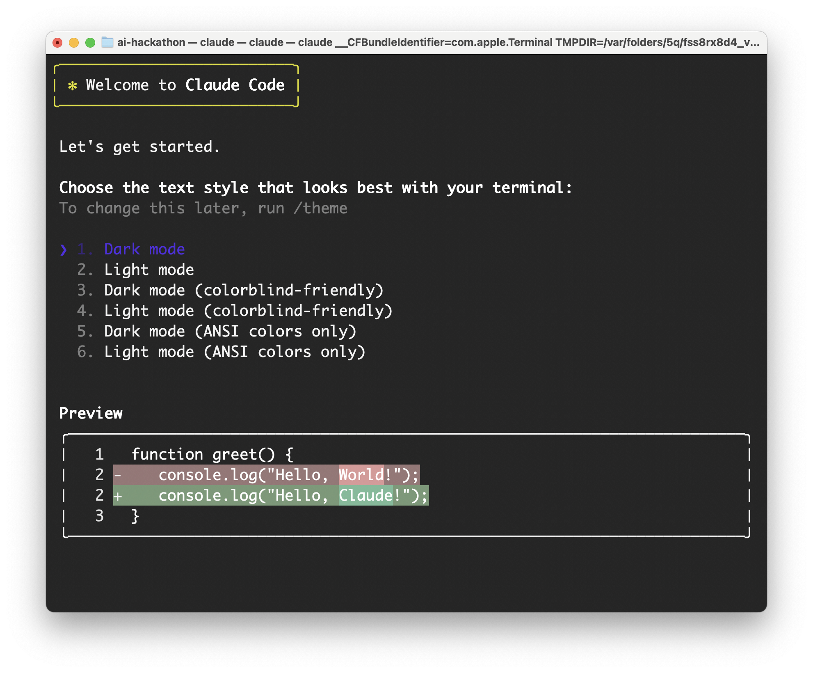
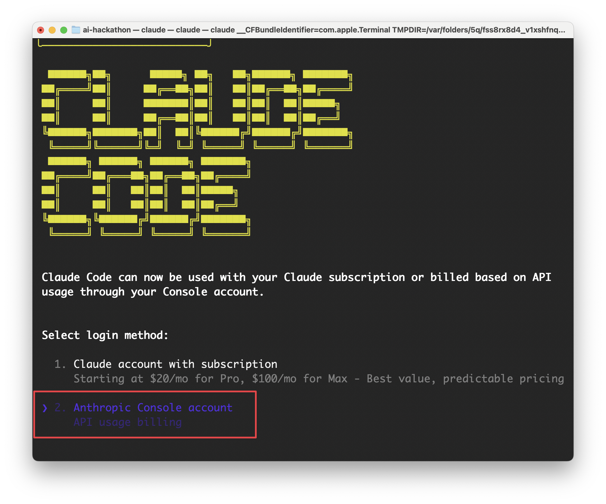
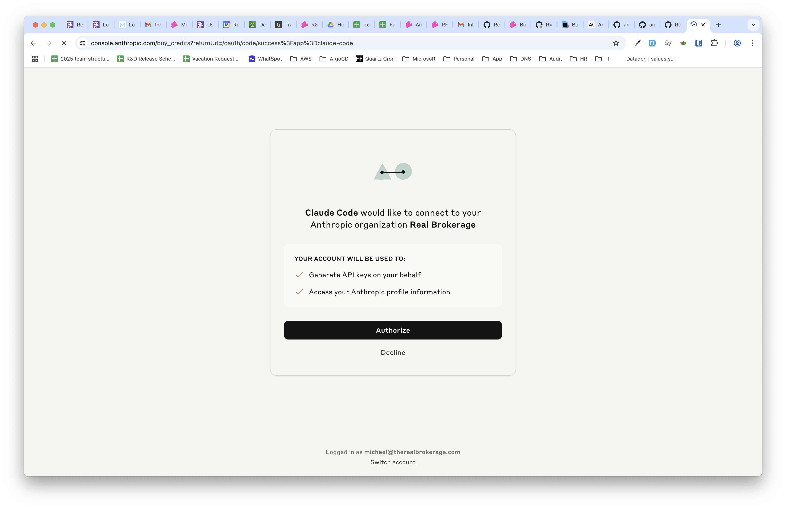

# 🚀 Hackathon Setup Guide

Welcome to the AI Hackathon! Follow these steps to get your machine ready for Claude-based development.

---

## 📧 1. Sign Up for Anthropic

You will receive an invitation email from **Anthropic**.

- Click the link in the email.
- Register for an account using your preferred email address.
- Once signed in, you'll have access to Claude and API tools.

---

## ✅ 2. Install Node.js (macOS)

We recommend using [Homebrew](https://brew.sh/) to install Node.js on your Mac.

Once Homebrew is installed, run:

```bash
brew install node
```

To verify the installation:

```bash
node -v
npm -v
```

You should see version numbers for both.

---

## 🧠 3. Install Claude Code CLI

Install the Claude CLI tool globally via npm:

```bash
npm install -g @anthropic-ai/claude-code
```

---

## ⚡ 4. Run Claude

Launch the Claude CLI from your terminal:

```bash
claude
```

On first launch, you'll be prompted to select how you're using Claude — choose:

**→ API user**

Claude will guide you through authenticating with your API key and setting up your environment.

### Initial Setup Walkthrough

**Step 1: Welcome Screen & Theme Selection**

*Choose your preferred terminal theme and preview code highlighting*

**Step 2: Login Method Selection**

*Select "Anthropic Console account" for API-based billing*

**Step 3: Authorization**

*Authorize Claude Code to connect to your Anthropic organization*

---

You're now ready to start coding with Claude. Have fun and build something amazing!
