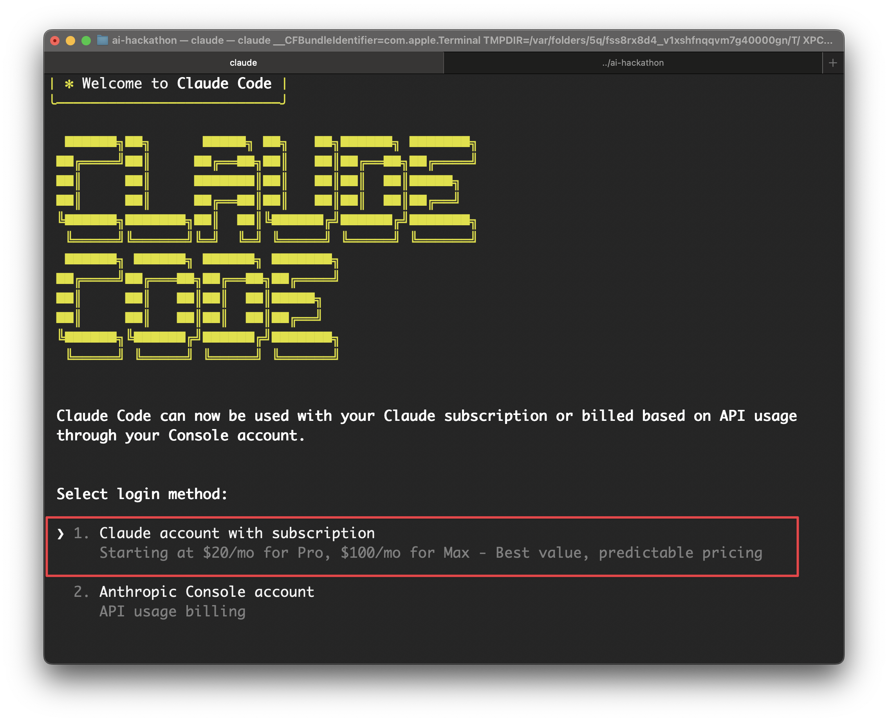
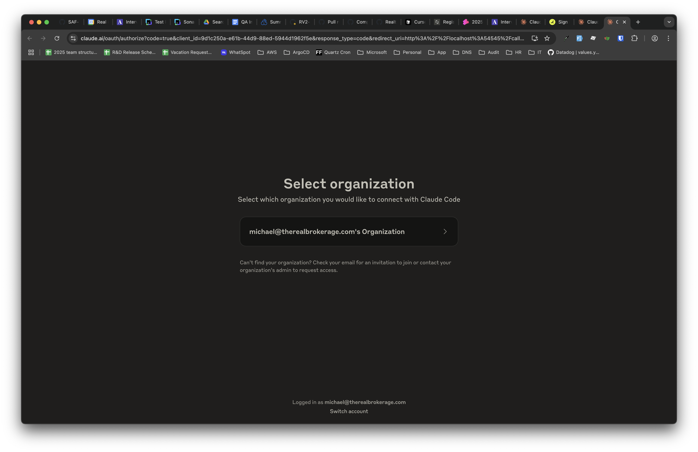

# 🚀 Hackathon Setup Guide

Welcome to the AI Hackathon! Follow these steps to get your machine ready for Claude-based development.

---

## 📧 1. Sign Up for Anthropic

You will receive an invitation email from **Anthropic**.

- Click the link in the email.
- Register for an account using your preferred email address.
- Once signed in, you'll have access to Claude and API tools.

---

## ✅ 2. Install Node.js (macOS)

**Open the Terminal application** to run the following commands.

First, check if you already have Node.js installed:

```bash
node -v
```

If you see version numbers for both, you can skip to step 3. If not, continue with the installation below.

### Install Homebrew (if not already installed)

We recommend using [Homebrew](https://brew.sh/) to install Node.js on your Mac. First, install Homebrew by running this command in your terminal:

```bash
/bin/bash -c "$(curl -fsSL https://raw.githubusercontent.com/Homebrew/install/HEAD/install.sh)"
```

**Important:** After installation, you'll need to add Homebrew to your PATH. Follow the instructions shown in your terminal, which typically look like this:


### Install Node.js

Once Homebrew is installed and added to your PATH, install Node.js:

```bash
brew install node
```

Verify the installation:

```bash
node -v
```

You should see version numbers for both.

---

## 🧠 3. Install Claude Code CLI

Install the Claude CLI tool globally via npm:

```bash
npm install -g @anthropic-ai/claude-code
```

---

## ⚡ 4. Run Claude

Before running Claude, create a new folder for your hackathon project:

```bash
mkdir hackathon
cd hackathon
```

Launch the Claude CLI from your terminal:

```bash
claude
```

Claude will guide you through authenticating with your API key and setting up your environment.

### Initial Setup Walkthrough

**Step 1: Welcome Screen & Theme Selection**

*Choose your preferred terminal theme and preview code highlighting*

**Step 2: Login Method Selection**

*Select "Anthropic Console account" for API-based billing. Use the **arrow keys** to navigate and press **Enter** to proceed.*

**Step 3: Authorization**

*Click the **Authorize** button to allow Claude Code to connect to your Anthropic organization*

---

## 📹 5. Watch the Example Walkthrough


Check out this explanatory video where we walk through an example project using Claude Code:

[**Watch Example Project Walkthrough →**](https://ro.am/recordings/play/42f6e513-ee9c-463a-a413-3b2524d3cebd?pwd=qI3rUc3aJ.8ubnm2fV.1jT1Qc4ioqK)

This video demonstrates real-world usage patterns and best practices for getting the most out of Claude Code during your hackathon project.

---

You're now ready to start coding with Claude. Have fun and build something amazing!
